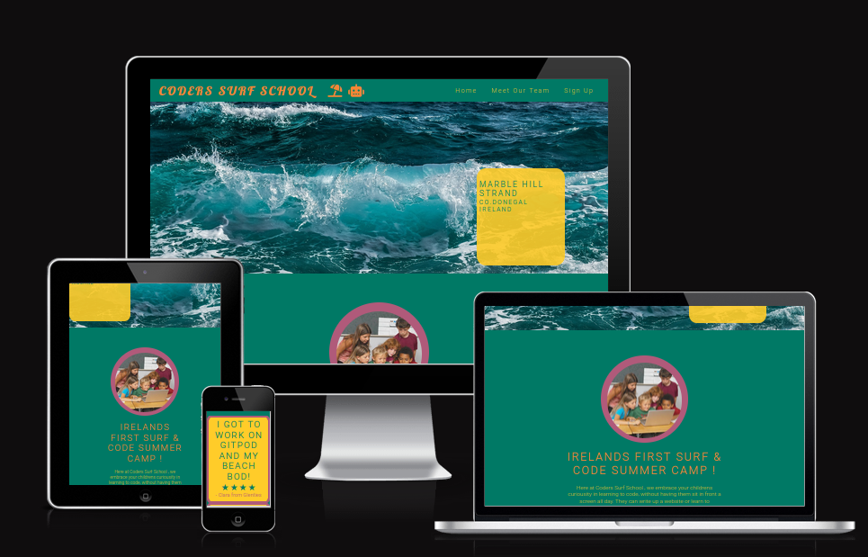
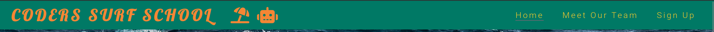
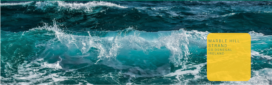
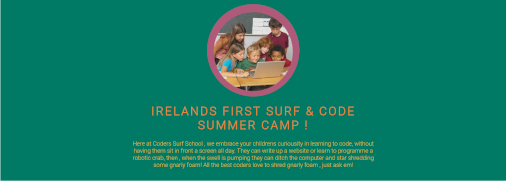
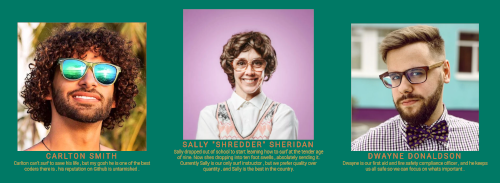
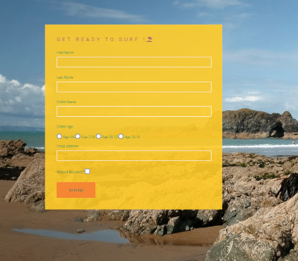

# Coders Surf School

This is a website for a new idea for a summer camp ; a mixture of coding and surfing . 
Users of this website will be able to ger an overview of what the camp is about. 
Parents will then be able to view the members of staff. 
They will then be able to submit a form for signup.

## Features

- Navigation 
    - There is a navbar at the top of the website that is present across all the pages of the site. 
    - On the left of this navbar is the site Logo , which is keeping with the theme of both surfing and coding. 
    - To the right of that we have our nav-links , and they are easy to read , and the active page is reflected by the underline of the link

- Sea Image
    - This image is there to add a pleasing look to the website, 
    and has the address included in an overlay.

- About Us 
    - This is a section where we convey what it is the camp is about, and try to give the customer a sense of the mood and atmosphere of the summer camp.

- Meet the Staff 
    - This is a little section to introduce the customer to the staff that are working at the summercamp , and a description of what it is that they do.

- The sign up form
    - This is the section of the site where the parent signs up their child for the summer camp, and there are options there including whether or not the child needs a wetsuit etc.

- Footer
    - This is a footer where the customer can visit the social media of the camp.
    - This is accessible across all of the pages on the site.

## Testing 

- I tested to see if the pages were working across multiple browsers.

- I used the "Am I responsive" website to see if my website was responsive.

- I checked to make sure that the text was legible across the differnt sections of the site . 

- I confirmed that the form was working as expected.

## Validator Testing 

- HTML 
    - I ran all of my HTML files and code through the validator , it passed.

    

- CSS 
    - Using the CSS validator , I checked my code to make sure it met the standards set by the W3C, and it passed.

    

- Accesibility
    - I confirmed that the fonts were legible, that all the images had an alt attribute. I ran it through lighthouse in DevTools.

    

## Deployment

- The site was deployed to Github pages.

## Media
-  All of the images used in the site were taken from [Pexels](https://www.pexels.com) and [Pixabay](https://pixabay.com/)

