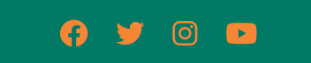
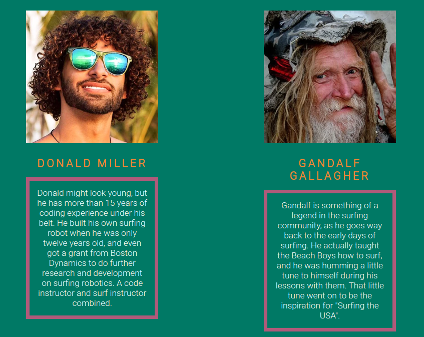
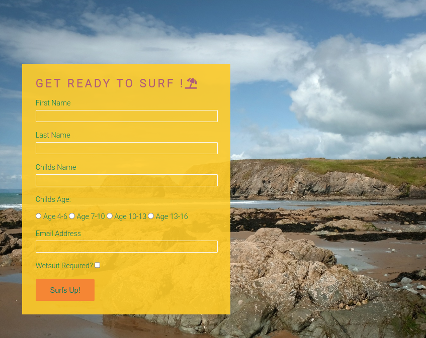

# Coders Surf School

This is a website for a new idea for a summer camp ; a mixture of coding and surfing . 
Users of this website will be able to ger an overview of what the camp is about. 
Parents will then be able to view the members of staff. 
They will then be able to submit a form for signup.

## <ins>Design</ins> 

### Choice of font

I went for a font that conveyed a sense of fun and play, and something that would make people think of a beach setting.
Eventually I settled on two fonts to keep things simple, a font for the larger headings, and a smaller , more simpler font for everything else. 
The larger font was called Lobster, and the smaller font was called Roboto. 
Both of which were found on Google fonts, and it was simple to add them into the code of my css via a link provided by Google.

### Choice of colours

I wanted to make the page look vibrant and "beachy" , so no drab colors, this had to look bold and to stand out with a contrast of cold colors that would convey a sense of the water, and other warmer colours that would remind the user of the sun. Together they help conjur an image of the beach in a users mind, and offer a sense of vibrancy and convey the idea that this is about fun! 

I chose four colours to make up the color pallette.

    -#007965
    -#B05A7A
    -#F58634
    -#FFCC29

Here is what they look like:

## Features

### Sticky Navbar

The style of Navbar that I have chosen is a sticky navbar. I have chosen this , because in the first section of the website, the homepage (index.html) is rather long at lower screen sizes, and I did not want the user to have to scroll all the way to the top if they wanted to navigate to another section of the website.

Example of the sticky navbar:

### About Section

Displays an overview of what the Camp is about and it's features. 

### Footer 

### Staff Bio's

### Form

## Testing 

| Test                              | Result |
| --------------------------------- | ------ |
| W3C HTML Validator                | ✓      |
| W3C CSS Validator                 | ✓      |
| Lighthouse                        | ✓      |
| Responsiveness across screensizes | ✓      |  

- I tested to see if the pages were working across multiple  browsers.

- I used the "Am I responsive" website to see if my website was responsive.  

- I checked to make sure that the text was legible across the differnt sections of the site .    

- I confirmed that the form was working as expected.  

## Validator Testing  

- HTML 
    - I ran all of my HTML files and code through the validator , it passed.

    

- CSS 
    - Using the CSS validator , I checked my code to make sure it met the standards set by the W3C, and it passed.

    

- Accesibility
    - I confirmed that the fonts were legible, that all the images had an alt attribute. I ran it through lighthouse in DevTools.

    

## Deployment

### I used Github pages to deploy this project, heres how:

-Login into Github
-Navigate to the repository for this project. (Coders Surf School)
-Click on Settings.
-Click on Pages.
-Click on source and choose main branch.
-Click Save.
-You will be provided with a live link to your hosted webpage!

### How to fork this project:

-Login to Github
-Navigate to the repository for this project. (Coders Surf School)
-Click the Fork button.

### How to clone this project:

-Log in (or sign up) to GitHub.
-Navigate to the repository for this project. (Coders Surf School)
-Click on the code button and copy the link that is provided.
-Navigate to a folder that you want to use in your editors terminal.
-Type 'git clone' into the terminal and then paste the link you copied. Hit enter.

## Media
-  All of the images used in the site were taken from [Pexels](https://www.pexels.com) and [Pixabay](https://pixabay.com/)

